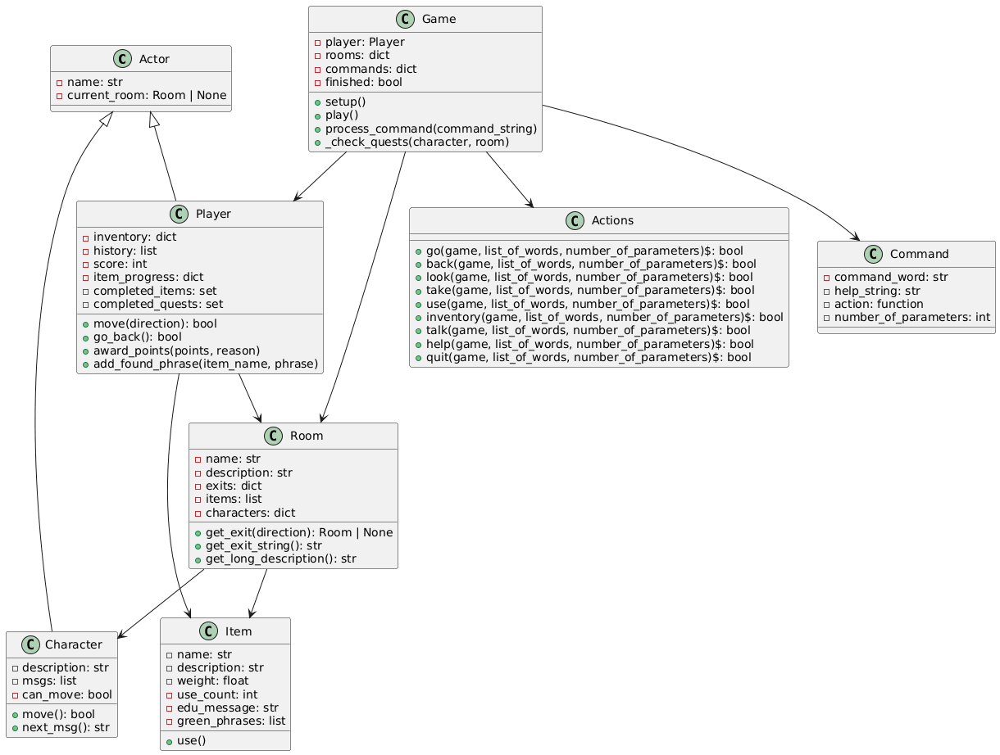

# Air ESIEE - Copilote A320 🚀

Projet final pour le module de Python – ESIEE Paris (2025)

**Par :** Messad Houcine & Thomas Quéro

---

## 📚 Table des matières

1. [Guide Utilisateur](#guide-utilisateur)
2. [Guide Développeur](#guide-développeur)
3. [Perspectives de Développement](#perspectives-de-développement)

---

## Guide Utilisateur

### 🧭 Description du Projet

**Air ESIEE – Copilote A320** est un jeu d'aventure textuel éducatif en Python, où vous incarnez un copilote stagiaire à bord d'un Airbus A320 de la compagnie Air ESIEE.

#### L'Univers

Lors d'un vol d'entraînement entre Paris et Nice, diverses pannes techniques, urgences ECAM, et situations humaines complexes surviennent. Vous devez :

- **Diagnostiquer** les anomalies via le système ECAM (Electronic Centralized Aircraft Monitor)
- **Suivre** les procédures QRH (Quick Reference Handbook)
- **Interagir** efficacement avec le commandant et les passagers
- **Prendre** des décisions rapides mais réfléchies

Le jeu combine apprentissage technique, simulation de vol et réflexion éthique.

### 💻 Installation

#### Prérequis

- Python 3.10+
- Tkinter (inclus par défaut avec Python)
- OS : Windows, macOS, Linux

#### Étapes d'Installation

```bash
git clone http://github.com/PoyTuSadre/air_esiee_tba
cd air_esiee_tba
```

#### Lancer le Jeu

**Mode terminal :**
```bash
python game.py
```

**Mode graphique (si disponible) :**
```bash
python game.py --gui
```

Si Tkinter n'est pas disponible, le jeu bascule automatiquement en mode texte.

### 🕹️ Commandes Principales

| Commande | Paramètre | Description |
|----------|-----------|-------------|
| `look` | — | Observer l'environnement actuel |
| `go` | `<direction>` | Se déplacer dans une direction |
| `take` | `<objet>` | Prendre un objet |
| `drop` | `<objet>` | Poser un objet |
| `use` | `<objet>` | Utiliser un équipement ou une checklist |
| `inventory` | — | Voir l'inventaire |
| `talk` | `<pnj>` | Parler à un personnage |
| `history` | — | Voir les salles visitées |
| `back` | — | Revenir à la salle précédente |
| `help` | — | Liste complète des commandes |
| `quit` | — | Quitter le jeu |

### 🎮 Comment Jouer

#### Objectif Principal

Le but est de ramener l'avion en sécurité tout en maintenant un bon score de performance. Chaque action impacte la sécurité, le stress de l'équipage, et le score final.

#### Environnement du Jeu

**Zones du Cockpit :**
- Siège du copilote
- Panneau central (ECAM, FCU, MCDU)
- Panneaux haut et bas
- Altimètre
- Radar

**Cabine Passagers :**
- Zone d'équipage
- Classe Business
- Classe Economy
- Zone arrière d'équipage

#### Progression du Vol

Le vol est simulé sur 30 minutes, avec des événements forcés à des moments critiques :

| Minute | Lieu | Événement |
|--------|------|-----------|
| 10 | Cockpit | Urgence ECAM |
| 15 | Cabine/Economy | Problème passager |
| 29 | Cockpit | Descente finale |

Le joueur est automatiquement transporté vers la zone concernée lors de chaque événement.

#### Exemple d'Utilisation

```
> look
Vous êtes dans le cockpit. L'ECAM affiche une alarme moteur gauche.

> talk Captain
Commandant : "Alarme moteur 1 ! Que faites-vous, copilote ?"

> take QRH
Vous prenez le QRH et suivez la checklist d'urgence.

> use "QRH - Engine Fire Procedure"
[ACTION] Vous consultez la procédure d'urgence...
[+7 pts] Excellente maîtrise du protocole (Total: 7 pts)

> go left
Vous êtes dans le panneau bas. Vous actionnez les commandes...

> talk Captain
Commandant : "Feu moteur maîtrisé ! Excellent réflexe, copilote."
```

### 🎯 Quête et Objectifs

#### Système de Checklists

Chaque salle contient des **checklists éducatives** identifiées par du texte surligné en vert. Votre tâche est de :

1. **Explorer** chaque zone du cockpit et de la cabine
2. **Identifier** les phrases importantes (textes verts)
3. **Utiliser** les équipements et consulter les procédures
4. **Interagir** avec les PNJ pour valider vos actions
5. **Accumuler des points** en respectant les bonnes procédures

### 💯 Système de Points

L'évaluation repose sur trois axes : **technique**, **communication**, et **gestion**.

#### 🛠️ Actions Techniques

| Situation | Décision | Points |
|-----------|----------|--------|
| Analyser instruments après urgence | Bonne analyse | +1 |
| Résoudre partiellement un problème | Avancée partielle | +3 |
| Résolution complète | Excellente maîtrise | +7 |
| Résolution avec légère perte | Bonne réaction | +4 |
| Résolution avec pertes majeures | Sauvetage minimal | +1 |
| Ignorer alarme ECAM | Mauvaise gestion | -3 |
| Erreur de checklist | Critique | -5 |

#### 🧑‍✈️ Gestion Humaine

| Situation | Décision | Points |
|-----------|----------|--------|
| Interaction positive avec commandant | Bonne communication | +2 |
| Interaction positive passagers / ATC | Empathie | +2 |
| Rassurer un PNJ | Leadership | +3 |
| Comportement froid ou agressif | Manque de communication | -2 |
| Garder son calme | Professionnalisme | +4 |
| Perdre son sang-froid | Stress mal géré | -3 |

#### ⚙️ Gestion et Anticipation

| Situation | Décision | Points |
|-----------|----------|--------|
| Vérifie systèmes avant action | Anticipation | +2 |
| Utilise le bon outil au bon moment | Bon jugement | +3 |
| Oublie un élément essentiel | Inattention | -2 |
| Priorise urgences correctement | Excellente hiérarchisation | +4 |

#### 🏁 Fin de Mission

| Résultat | Points |
|----------|--------|
| Vol terminé sans incident | +10 |
| Vol terminé avec déroutement maîtrisé | +5 |
| Vol terminé avec pertes majeures | +2 |
| Crash ou erreur fatale | -10 |
| Quitte avant fin du vol | -5 |

#### Évaluation Finale

| Score | Évaluation | Mention |
|-------|-----------|---------|
| 90–100 | Pilote d'exception | 🥇 Or |
| 75–89 | Copilote confirmé | 🥈 Argent |
| 50–74 | Copilote stagiaire | 🥉 Bronze |
| 0–49 | Non qualifié | ❌ Échec |

### 🎲 Conditions de Victoire / Défaite

**Victoire :** 
- Vol terminé sans incident majeur
- Tous les objectifs techniques complétés
- Bonnes interactions avec l'équipage et les passagers

**Défaite :**
- Erreur critique sans récupération possible
- Crash suite à une mauvaise décision
- Ignorer les procédures d'urgence
- Stress de l'équipage trop élevé

**Mode Apprentissage :** Chaque erreur est commentée pour vous permettre de progresser.

---

## Guide Développeur

### 📊 Architecture du Projet

Le projet suit une architecture orientée objet avec les classes suivantes :

- **Game** : Gère l'état global du jeu, les commandes et la logique
- **Player** : Représente le joueur (inventaire, position, score)
- **Room** : Représente les salles (sorties, objets, PNJ)
- **Item** : Représente les objets/checklists
- **Character** : Représente les PNJ (position, dialogue)
- **Command** : Représente une commande du jeu
- **Actions** : Contient les actions exécutables
- **Actor** : Classe mère pour Player et Character

### 🧩 Diagramme de Classes



### 📁 Structure des Fichiers

```
air_esiee_tba/
├── INDEX.py              # Point d'entrée principal
├── game.py               # Logique du jeu et interface GUI
├── player.py             # Classe Player
├── character.py          # Classe Character
├── room.py               # Classe Room
├── item.py               # Classe Item
├── actor.py              # Classe mère Actor
├── command.py            # Classe Command
├── actions.py            # Implémentation des actions
├── config.py             # Configuration globale
├── generate_images.py    # Génération des images (GUI)
├── images/               # Ressources graphiques
└── README.md             # Documentation
```

### 🔧 Fonctionnalités Clés

- **Système de commandes** : Chaque commande est mappée à une action spécifique
- **Gestion de l'inventaire** : Les objets collectés sont stockés et gérés
- **Système de points** : Suivi et récompense des bonnes décisions
- **Checklists éducatives** : Les phrases vertes sont extraites et trackées
- **Support GUI** : Interface Tkinter avec redirection ANSI pour les couleurs
- **Historique** : Suivi des salles visitées et des actions effectuées

---

## 🎨 Perspectives de Développement

### Court Terme

- **Interface graphique améliorée** avec :
  - Affichage des jauges ECAM en temps réel
  - Systèmes d'alarme visuels et sonores
  - Thème immersif Air ESIEE avec textures et animations

- **Amélioration des PNJ** :
  - Comportements dynamiques basés sur le stress
  - Émotions visibles (peur, confiance, frustration)
  - Dialogue adaptatif selon les décisions du joueur
  - Mémoire des interactions précédentes

- **Système de pannes dynamique** :
  - Générateur procédural de pannes
  - Combinaisons aléatoires d'urgences
  - Difficulté progressive selon le niveau du joueur
  - Banque de scénarios historiques réalistes

### Moyen Terme

- **Mode multijoueur coopératif** :
  - Un joueur pilote, un joueur copilote
  - Communication temps réel via chat/VoIP
  - Résolution collaborative des crises
  - Synchronisation des actions

- **Analyse statistique des sessions** :
  - Historique complet des actions avec timestamps
  - Points d'amélioration identifiés automatiquement
  - Comparaison avec les meilleures performances
  - Graphiques de progression

- **Support pédagogique avancé** :
  - Explications détaillées lors des erreurs
  - Tutoriels contextuels et progressifs
  - Mode expert sans assistance
  - Glossaire technique intégré

- **Extension du contenu** :
  - Traduction multilingue (EN, ES, DE, etc.)
  - Niveaux de difficulté supplémentaires
  - Missions éducatives variées

### Long Terme

- **Support d'autres aéronefs** :
  - Airbus A380 avec configurations alternatives
  - Boeing 737 et ses variantes
  - Modèles commerciaux et militaires

- **Intégration avec des simulateurs professionnels** :
  - Connexion avec X-Plane ou Microsoft Flight Simulator
  - Support des contrôleurs matériels (Thrustmaster, Logitech)
  - Échange de données en temps réel
  - Possibilité VR/immersive avec casques compatible

- **Plateforme communautaire en ligne** :
  - Partage de scénarios personnalisés
  - Classement global des meilleurs pilotes
  - Modération et système de notation
  - Création de contenu utilisateur via éditeur intégré

- **Intégration éducative** :
  - API pour LMS (Moodle, Blackboard, Canvas)
  - Suivi des apprentissages des étudiants
  - Génération de rapports pédagogiques
  - Certification automatique
